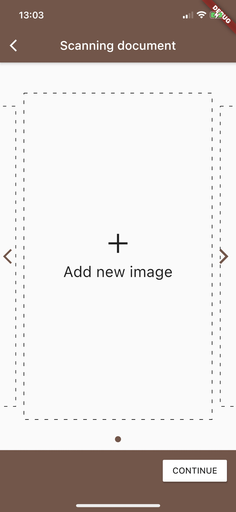
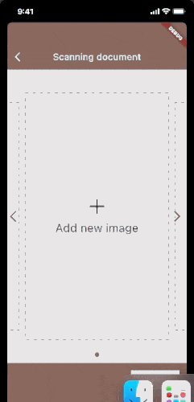
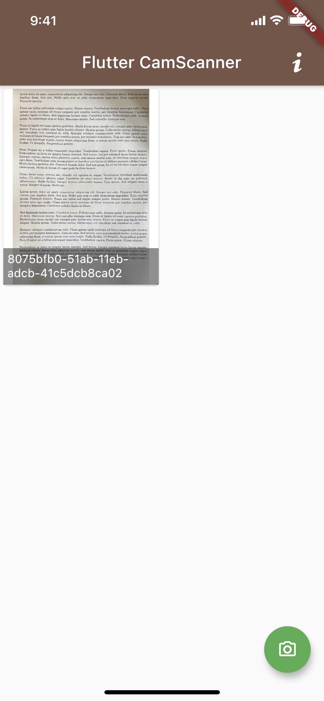
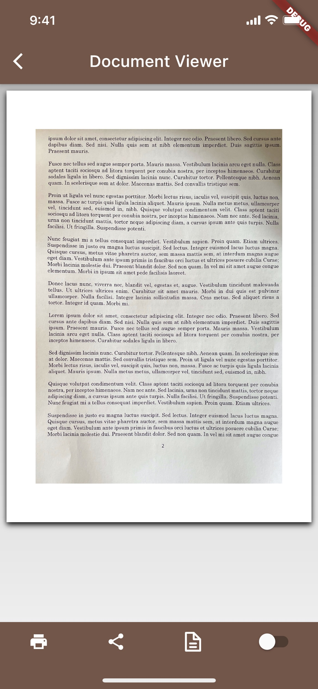
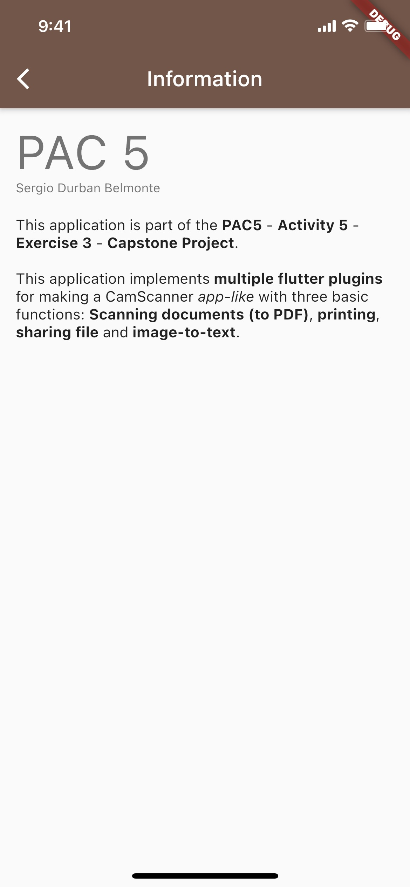

# UOCReactNativeFlutter - Activity 5 - Exercise 3

This is a Capstone project for subject ``New Trends in Mobile Development`` course taken at the Open Universitoy of Catalonia (www.uoc.edu).

## What does this project

With this project the user can Scan documents (paper/national documents...) and generate a PDF.

This pdf can be printed, shared or OCR to text.

## Libraries in this project

- [http](https://pub.dev/packages/http): Used for calling ocr.space for passing pdf to text and print in screen.
- [edge_detection](https://pub.dev/packages/edge_detection): The scanner library, uses native.
- [path_provider](https://pub.dev/packages/path_provider): Used for searching document path across ios/android.
- [uuid](https://pub.dev/packages/uuid): Used for generate a unique identifier for each document scanned.
- [pdf](https://pub.dev/packages/pdf): For generating the pdf from images.
- [printing](https://pub.dev/packages/printing): Rendering, sharing and printing the pdf.
- [rflutter_alert](https://pub.dev/packages/rflutter_alert): Library with alert <1MB pdf (limit of API OCR).
- [flutter_swiper](https://pub.dev/packages/flutter_swiper): Carrousel of images in scanning page.
- [r_dotted_line_border](https://pub.dev/packages/r_dotted_line_border): Decoration of add Image in carrousel.
- [get_it](https://pub.dev/packages/get_it): Service locator for services.
- [injectable](https://pub.dev/packages/injectable): Code generator for get_it automatically register services into Service locator.
- [fontisto_flutter](https://pub.dev/packages/fontisto_flutter): Icons

-----
- [build_runner](https://pub.dev/packages/build_runner): A build system for Dart code generation and modular compilation.
- [injectable_generator](https://pub.dev/packages/injectable_generator): Code generator for injectable.

## How to regenerate autogenerated code from Dependency injection.

`flutter pub run build_runner build --delete-conflicting-outputs`

### Work in progress in testing!!!

## Images

